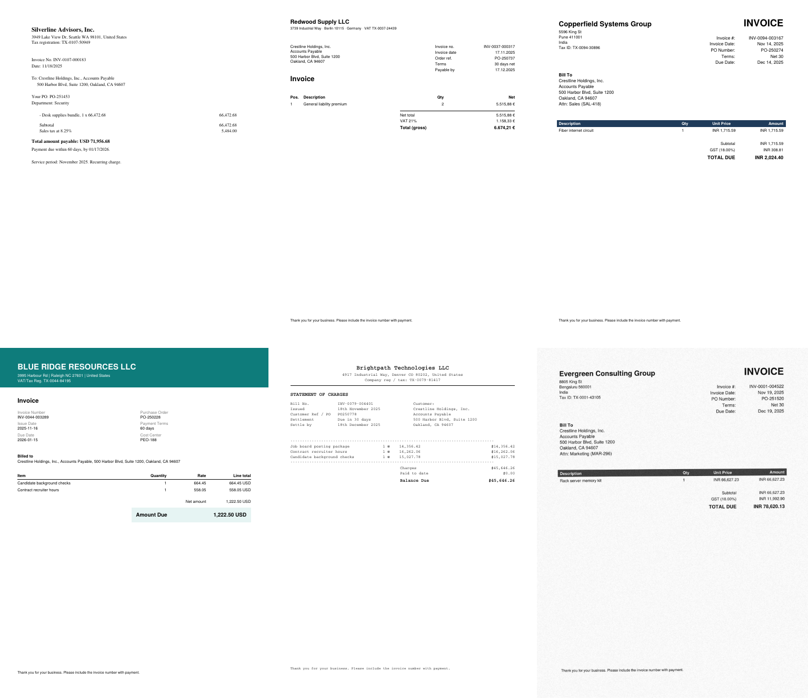

# AI Invoice Processing

A follow-up to my [Accounts Payable modeling project](AP_Modeling_README.md). That project asked *which invoices need a person to review them, and how many reviewers do we need?* It assumed someone had already typed every invoice into the system.

This project automates that typing step. It takes invoice PDFs, pulls out the fields, checks each invoice against its purchase order and the vendor master, approves clean invoices automatically, and sends the rest to the review queue from the AP project.



> On GitHub, all project files sit together in this `files` folder. The scripts expect the layout of the full project (`src/`, `data/`, `invoices/`, `output/`), so to run them, put the `.py` files in `src/` and the workbook in `data/`.

## What it does

1. **Makes realistic invoices.** It turns the 1,000 invoices from the AP model's test period (Nov 19, 2025 – Jan 5, 2026) into PDFs.
   - There are 5 supplier layouts, with different date formats (`11/18/2025`, `17.11.2025`, `18th November 2025`) and number formats (`1.234,56 €`, `INR 1,23,456.78`). Labels also differ by layout.
   - 836 invoices are PDFs: 708 digital and 128 scanned images with skew and noise.
   - The other 164 invoices arrive by EDI as structured data.
   - The true value of every field is saved so accuracy can be measured.
2. **Reads the invoices in two ways.**
   - **Rules + OCR (today's common approach):** reads the PDF text, or uses Tesseract OCR for scans, then applies regex rules written for each layout. I wrote rules for layouts A–D only. Layout E is held out as a "new supplier" the rules have never seen.
   - **Claude (LLM):** sends the PDF straight to Claude, which returns the fields as JSON through a forced tool call. There are no templates and no OCR step.
3. **Matches each invoice and runs the controls.** Each invoice is matched to a vendor by tax ID, falling back to name only when the name is unique. The vendor master has six names listed twice under different IDs, so name alone isn't safe. Each invoice is also matched to its PO. The controls from the AP project then run:
   - missing or invalid PO
   - PO belongs to another vendor
   - currency mismatch
   - invoice over PO amount
   - payment terms mismatch
   - inactive vendor
   - duplicate invoice
   - high-risk vendor
4. **Checks the extracted data before trusting it.**
   - Are all required fields there?
   - Does subtotal + tax = total?
   - Does due date = invoice date + terms?
   - Is OCR confidence high enough?

   If a check fails, a person fixes the fields first (a "data check"), so a reading error can never approve an invoice.
5. **Decides:** auto-approve, data check, or exception review.
6. **Simulates the review queue** with the AP project's queue model: 1–4 reviewers, FIFO vs risk-priority order, 8-business-hour SLA. The AP project's random forest now only sets the order of the queue. The yes/no decision comes from the controls, which auditors can trace line by line.

## Results (1,000 invoices, 6.6 weeks)

Claude Haiku 4.5 read all 836 PDFs for $3.98 total, about half a cent per invoice.

| | Current process | Rules + OCR | Claude (LLM) | Perfect reading (ceiling) |
|---|---|---|---|---|
| Invoices approved with no one touching them | 0% | 62.1% | **70.4%** | 71.2% |
| PDFs with every field read correctly | – | 82.1% | **97.8%** | 100% |
| Invoices sent to a person to fix fields | – | 140 | **12** | 0 |
| Real exceptions caught | 243 / 243 | 243 / 243 | 242 / 243 | 242 / 243 |
| Average days to approve | 4.7 | 2.8 | **2.5** | 2.5 |
| AP staff hours (typing + review) | 320 | 292 | **276** | 275 |
| Reviews within 8 business hours (2 reviewers) | 90.1% | 83.1% | 83.4% | 83.7% |

Share of PDFs with every field read correctly, by type of invoice:

| | Rules + OCR | Claude |
|---|---|---|
| Known layouts (A–D), digital | 100% | 98.8% |
| Known layouts (A–D), scanned | 79.6% | 94.2% |
| New layout (E), digital | 0% | 96.2% |
| New layout (E), scanned | 0% | 96.0% |

What this shows:
- **Claude reads new layouts without any setup.** The rules are perfect on clean digital PDFs of layouts they were written for. They fall to 80% on scans and 0% on the new supplier layout until someone writes a new template. Claude stayed at 94–99% across every layout and format with no templates. That gets touchless processing to 70.4%, almost the 71.2% ceiling. The ceiling is what you get if every field is read perfectly and the controls do the rest.
- **The data checks caught most of Claude's mistakes.** Claude got 18 of 836 PDFs wrong in some way:
  - 11 were non-US dates like `07/12/2025` (7 December) that it read month first. 1 was a garbled output where the payment terms landed inside the due-date field. All 12 were stopped by the data checks (due date didn't match the date plus terms, or a field was missing) and sent to a person.
  - 4 left the due date blank on the new layout. That's harmless, because the due date can be filled in from the invoice date and payment terms.
  - 2 misread one digit of the invoice number on a scan. Both went to review for other reasons, but no check catches this kind of error. A wrong invoice number could let a duplicate slip through, so a real system should compare invoice numbers against each vendor's usual pattern.
- **Rules miss 140 invoices a person has to type in.** Most are from the new layout. That's 128 more manual touches than Claude in 6.6 weeks.
- **The one missed exception is a data quirk, not a reading error.** In the source data, a duplicate pair is labeled so that the copy received *first* is the "duplicate". My system flags whichever copy arrives second, so it blocks the other copy of the pair. The Rules + OCR run shows 243/243 only because it couldn't read that invoice (new layout) and sent it to a person.
- **The SLA is a little lower with 2 reviewers** because the queue has more work in it:
  - I review every invoice from a high-risk vendor. Today only a sample is reviewed: 8 of the 40 high-risk invoices that had no other problem. That adds 32 reviews.
  - The duplicate-pair quirk above adds 14 more.

  With 3 reviewers the SLA is 95%.

### Note on the AP project's model
In the AP data, "Manual Review Required" is "Yes" exactly when an exception type is recorded, so the target comes from the rules. The random forest's 97% accuracy mostly comes from re-learning the control flags. This project keeps the rules in charge of the decision and uses the model only to rank the queue.

## Assumptions (all in `src/process.py`)
- Keying and matching one invoice by hand takes 6 minutes. A data check takes 6 minutes, plus a full review if the fixed invoice turns out to have an exception.
- Review times come from the AP project's review log. The median is used for invoices that were never reviewed in the source data.
- Clean invoices that are approved automatically clear the same day. Everything else keeps the approval time from the source data. That time is 1–5 days even for clean invoices today.
- Benchmark context: Ardent Partners' *AP Metrics That Matter in 2025* reports about 49% touchless processing and $2.78 per invoice for top-performing AP teams, vs $10.89 on average.

## How to run

```bash
pip install -r requirements.txt          # also needs tesseract-ocr and poppler-utils
python src/generate_invoices.py          # 836 PDFs + ground truth
python src/extract_rules.py              # Rules + OCR baseline
export ANTHROPIC_API_KEY=...             # optional
python src/extract_llm.py                # Claude reads the PDFs ($3.98 on Haiku 4.5)
python src/process.py                    # matching, controls, decisions, queue, scoring
```

Or open `AI_Invoice_Processing.ipynb` in Google Colab. It runs the Claude step and the scoring.

## Files
- `src/generate_invoices.py`: builds the PDFs (5 layouts, scans) and the ground truth
- `src/extract_rules.py`: pdfplumber / Tesseract + regex baseline
- `src/extract_llm.py`: Claude extraction with a JSON schema; results are cached per invoice
- `src/process.py`: vendor and PO matching, controls, data checks, decisions, queue simulation, scoring
- `src/ap_modeling_pipeline.py`: the AP project's model and queue code, reused here
- `output/`: results tables for Tableau (`summary_by_method.csv`, `field_accuracy.csv`, `invoice_decisions.csv`, `queue_simulation.csv`)

All data is synthetic.
